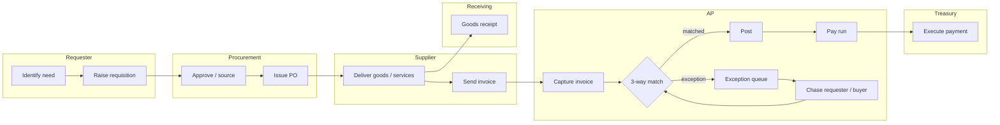
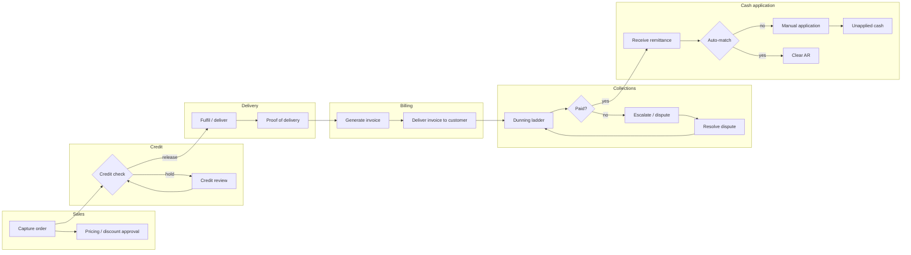
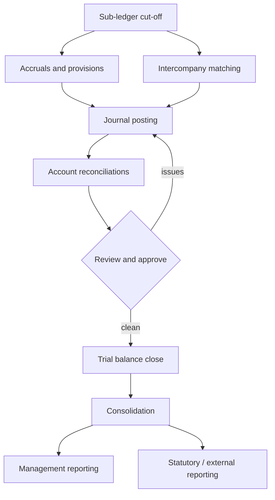
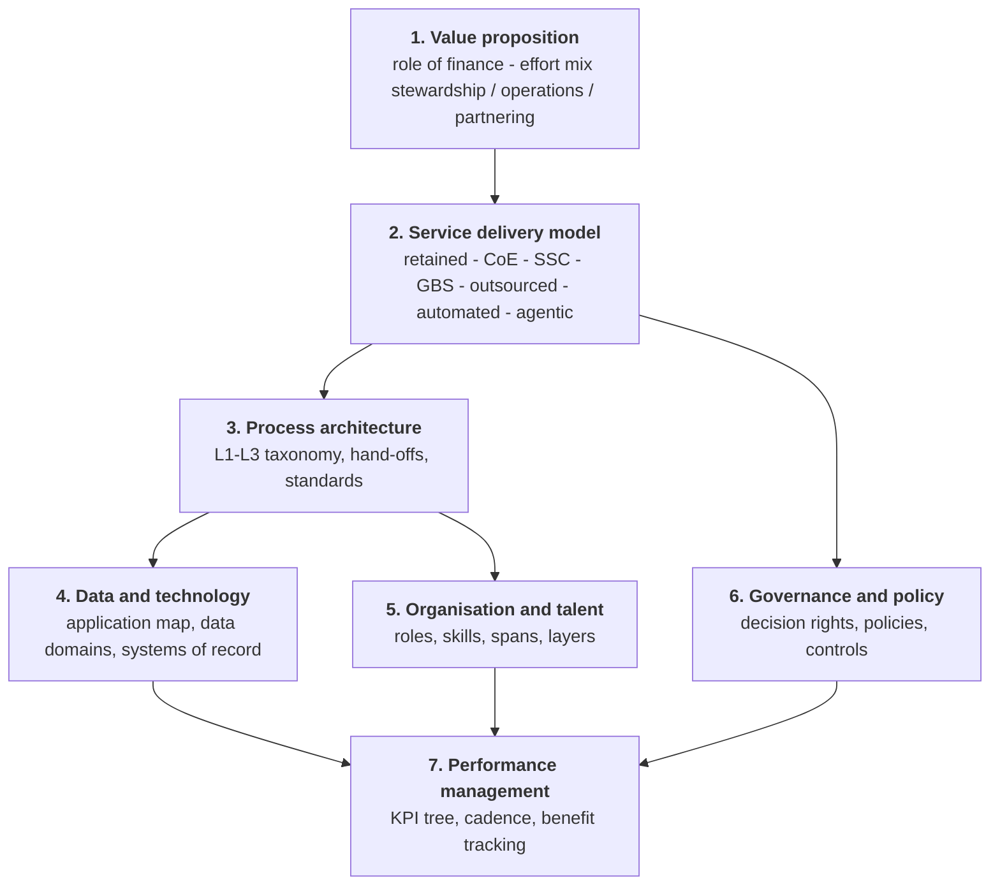

# Reference process flows and diagram definitions

Ready-to-render definitions for the diagrams an assessment needs. Feed the swimlane blocks to the
`swimlane-diagram` skill, the Mermaid blocks to any Mermaid renderer (Artifacts render them
natively), and the layer diagram to `transformation-architecture-diagram`.

**These are reference models.** Redraw every flow against what the client actually does — the
value of a hand-off map is that it shows *their* hand-offs. Use these to structure the interview
and to mark the deltas, never as the finding itself.

---

## 1. Purchase-to-Pay — hand-off map

Lanes are where the work sits; the hand-offs between lanes are where the defects are.

**Where to look:** invoices arriving with no PO (policy) · goods receipt not entered (process) ·
supplier master duplicates causing match failure (data) · exception queue with no ageing or owner
(process + people) · manual payment proposals (technology).

**Metrics to capture per hand-off:** volume, % first-pass match, exception ageing, touches per
invoice, cost per invoice (benchmark: `ap_cost_per_invoice`).

---

## 2. Order-to-Cash — hand-off map

**Where to look:** pricing exceptions creating billing disputes (policy) · credit limits reviewed
annually (policy) · invoice delivery by post/PDF email (technology) · collectors also handling
disputes and cash application (people) · unapplied cash with no ageing (process).

For depth here switch to the `ar-diagnostic` skill (06) — it carries the DSO/CEI/ADD baseline script.

---

## 3. Record-to-Report — close flow

**Where to look:** intercompany differences found after cut-off (process) · manual and upload
journals as a share of postings (`je_automation`) · reconciliations in spreadsheets reviewed by
email (technology + policy) · rework loop F→D as the real driver of close length.

**Metric:** days from trial balance to consolidated statements (`close_days_monthly`).

---

## 4. Blueprint layers — target-state diagram

Use with the consistency tests in `references/target-operating-model.md` §1 — the arrows are the
tests: a change in an upper layer that produces no change below it is the defect to hunt.

---

## 5. Current → target shift table

The most persuasive single page in an assessment deck. One row per headline shift, each tagged
with its lens and the initiative that delivers it.

| # | Dimension | Today | Target | Lens | Initiative |
|---|---|---|---|---|---|
| 1 | Invoice processing | 38% manual intervention, no-PO tolerated | Touchless standard path, no-PO-no-pay enforced | Policy | INI-02, INI-08 |
| 2 | Close | 9 days, 4 on intercompany | 5 days, intercompany matched pre-close | Process | INI-04 |
| 3 | Reporting | 3 versions of revenue by region | One definition, one owning system | Data | INI-05 |
| 4 | FP&A effort | 70% data preparation | 60% analysis | People | INI-05, INI-06 |
| 5 | Collections | Reactive, spreadsheet worklists | Behaviour-based dunning, automated matching | Process | INI-03 |
| 6 | Delivery model | Fragmented across 11 entities | GBS with E2E process ownership | People | INI-10 |

---

## 6. Roadmap wave diagram

```mermaid
gantt
  title Finance transformation roadmap
  dateFormat X
  axisFormat %s
  section Wave 1 - Prove
  Master data ownership and cleanse   :0, 4
  Intercompany calendar and ownership :0, 4
  Collections and cash application    :0, 6
  No-PO-no-pay enforcement            :4, 5
  section Wave 2 - Core
  Journal automation and reconciliation :6, 8
  Single reporting layer                :6, 12
  Touchless invoice processing          :9, 10
  Retire duplicate reports              :18, 3
  Driver-based rolling forecast         :18, 9
  section Wave 3 - Structural
  Finance delivery model move to GBS    :19, 18
```

Numbers are months from programme start and match `assets/initiative-backlog-template.csv` as
scheduled by `ft_analyze.py roadmap`. Regenerate after any change to the backlog rather than
editing this by hand.
